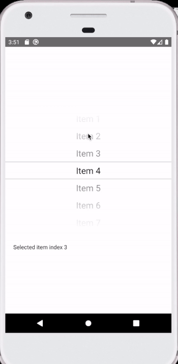
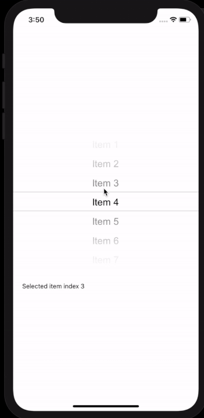

# react-native-dynamically-selected-picker

React Native Picker for Android and IOS with dynamically updating selected items on scroll.
Idea was taken at [react-native-swipe-picker]( https://github.com/ninio/react-native-swipe-picker
)





## installation

`yarn add react-native-dynamically-selected-picker react-native-linear-gradient`

or

`npm i react-native-dynamically-selected-picker react-native-linear-gradient --safe`

Then, if you didn't install `react-native-linear-gradient` before: Enter command `cd /ios` and `pod install`. Now you can run project

#Basic usage

```
import DynamicallySelectedPicker from 'react-native-dynamically-selected-picker';

<DynamicallySelectedPicker
  items={[
    {
      value: 1,
      label: 'Item 1',
      itemColor: 'red'
    },
    {
      value: 2,
      label: 'Item 2',
      itemColor: 'green'
    },
    {
      value: 3,
      label: 'Item 3',
    },
  ]}
  onScrollDynamicallyChange={({index, item}) => {
    this.setState({selectedItemIndex: index});
  }}
  height={300}
  width={300}
/>
```

## Properties

| Prop           |     Default     |   Type   | Description                                                                                                 |
| :------------- | :-------------: | :------: | :---------------------------------------------------------------------------------------------------------- |
| items     |     [{value: 0, label: 'No items', itemColor: 'red'}]       |  `Array<object>` | - |
| onScrollDynamicallyChange     |      -       |  `func` | Returns selected item object and selected index  |
| onScrollBegin     |      -       |  `func` | Returns selected item object and selected index  |
| onScrollEnd     |      -       |  `func` | Returns selected item object and selected index  |
| initialSelectedIndex          |        0        | `number` | Set index number of initial item.                                                                              |
| transparentItemRows   |     2      |  `number`  | Set number of items at top and bottom of selected index.                                                                |
| width   |     300      |  `number`  | -                                                                |
| height   |     300      |  `number`  | -                                                                |
| allItemsColor          |      #000       |  `string`  | - |
| selectedItemBorderColor          |      '#cecece'       |  `string`  | - |
| fontSize          |      -       |  `number`  | - |
| fontFamily          |     'Arial       |  `string`  | - |
| topGradientColors | [...] |  `Array<string>`  | See default value in source.                                                          
| bottomGradientColors | [...] |  `Array<string>`  | See default value in source.                                                            |
